# PriceZap — Amazon Price Tracker & Price History Platform
## Document 1 of 6: Vision, Product Requirements, SDLC Roadmap & Timeline

> This is the first of a grouped documentation set. Later files will cover:
> (2) Architecture, System Design, Flowcharts, DB Design · (3) API Docs, Folder Structure, Backend Architecture ·
> (4) Infrastructure, DevOps, Security · (5) Testing, Monitoring, Scalability · (6) General Documentation, Resume/Interview Prep, Startup Roadmap

---

## 1. Project Vision

### 1.1 Problem Statement
Prices on Amazon (and quick-commerce platforms like Blinkit, Zepto, Instamart, BigBasket, JioMart) fluctuate constantly and unpredictably. Buyers have no reliable, India-relevant way to know:
- Whether a listed price is actually a good deal relative to historical prices
- When a price drops to a threshold worth acting on
- How a product's price compares across platforms at the same moment

Existing global tools (CamelCamelCamel, Keepa) are Amazon-only, US/EU-centric, and don't cover Indian quick-commerce. There's a gap for an India-first, multi-platform price intelligence tool.

### 1.2 Vision
Build a production-grade price tracking platform — starting with Amazon India, already extended into quick-commerce comparison — that gives users price history, drop alerts, and cross-platform comparison in one place, backed by a real, deployed backend (not a prototype).

### 1.3 Goals
- Reliable, scheduled price capture per tracked product
- Historical price charts per product (not just "current price")
- Threshold-based and percentage-drop alerts via push notification
- Cross-platform price comparison for quick-commerce goods
- A backend architecture resilient to anti-scraping measures (the current, real, active constraint)

### 1.4 Scope
**In scope (current + near-term):**
- Amazon India product tracking (price, title, image, rating)
- Price history storage and retrieval
- User accounts, favorites/watchlist, alert rules
- Quick-commerce price comparison (Blinkit, Zepto, Instamart, BigBasket, JioMart)
- Push notifications for price drops

**Out of scope (for now, tracked as future features below):**
- Browser extension
- Multi-region (non-India) support
- Full multi-store expansion (Flipkart, Walmart, Best Buy)
- AI recommendation engine

### 1.5 Target Users
- Price-conscious online shoppers in India
- Deal-hunters who currently manually check multiple apps
- Anyone burned by "fake discount" pricing (inflate-then-discount patterns)

### 1.6 Business Model
- Free tier: limited tracked products, daily price checks
- Premium tier: unlimited tracking, faster check frequency, multi-platform comparison, advanced alerts
- Long-term: affiliate commissions via Amazon Associates (also solves the API/scraping problem — see Document 4)

### 1.7 Functional Requirements
- Users can search for and track a product by URL or search term
- System periodically fetches current price for tracked products
- System stores every price observation with a timestamp
- Users can set alert thresholds (absolute price or % drop)
- System sends a push notification when a threshold is crossed
- Users can view a price history chart for any tracked product
- System supports concurrent scraping across multiple platforms without rate-limit collisions

### 1.8 Non-Functional Requirements
- **Reliability:** scraper failures on one product must not block the batch
- **Resilience:** must tolerate anti-bot blocking (real, current issue — see Document 4 for the Product Advertising API migration plan)
- **Performance:** cached reads for product pages; DB writes batched where possible
- **Security:** JWT-based auth, RLS on all user-scoped tables
- **Cost:** must run on free/near-free infrastructure at current scale (Railway + Vercel + Supabase + Redis)

### 1.9 Success Metrics
- % of tracked products with unbroken daily price history (data completeness)
- Alert delivery latency from price-drop detection to push notification
- Scraper success rate (non-blocked requests / total requests)
- Weekly active trackers (users with ≥1 active watch)

---

## 2. Product Requirements Document (PRD)

### 2.1 MVP Features (already built or in active development)
| Feature | Status |
|---|---|
| Playwright-based Amazon scraper | Built |
| Redis caching layer (TTL-based) | Built |
| Supabase/PostgreSQL schema with RLS | Built |
| JWT authentication | Built |
| Price alert cron job + Expo push notifications | Built |
| Quick-commerce scrapers (Blinkit, Zepto, BigBasket, JioMart) | Built |
| Fuzzy cross-platform product matching (Fuse.js) | Built |
| Deployed backend (Railway) + frontend (Vercel) | Deployed |
| Reliable Amazon data access (Product Advertising API) | In progress — active blocker |

### 2.2 User Stories
- As a user, I want to paste an Amazon product link so the app starts tracking its price.
- As a user, I want to set a target price so I'm notified only when it's worth acting on.
- As a user, I want to see a price history graph so I can judge if "40% off" is a real discount.
- As a user, I want to compare a grocery item's total cost (price + delivery fee) across quick-commerce apps before ordering.
- As an admin, I want visibility into scraper health so I know when a platform's price feed is broken.

### 2.3 Acceptance Criteria (sample — full catalog in Document 3)
**Track a product:**
- Given a valid Amazon product URL, when submitted, then the system creates a tracked product record and captures an initial price within 60 seconds.
- Given an invalid or unreachable URL, when submitted, then the system returns a clear validation error and does not create a partial record.

**Price alert:**
- Given a user-set threshold, when the observed price is at or below it, then a push notification is sent within one cron cycle.
- Given no threshold crossed, then no notification is sent (no false positives).

### 2.4 Future Features
- Browser extension (auto-detect product page, one-click track)
- AI-based "is this actually a good deal" scoring using price history
- Multi-store expansion: Flipkart, Meesho, Ajio
- Admin dashboard for scraper health monitoring

### 2.5 Premium Features
- Unlimited tracked products (free tier capped)
- Higher-frequency price checks (e.g. hourly vs daily)
- Cross-platform comparison for quick-commerce
- Priority alert delivery

### 2.6 Admin Features
- Scraper success/failure dashboard
- Manual re-trigger of a failed scrape
- User and subscription management

### 2.7 Browser Extension Features (future)
- Detect Amazon product page, show price history inline
- One-click "track this product"

### 2.8 Mobile App Features (future)
- React Native app (already the planned frontend stack for the quick-commerce side)
- Push notifications via Expo (already integrated on the backend side)

### 2.9 AI Features (future)
- Deal-quality scoring model using historical price data
- Predictive "best time to buy" suggestion

---

## 3. Complete SDLC Roadmap

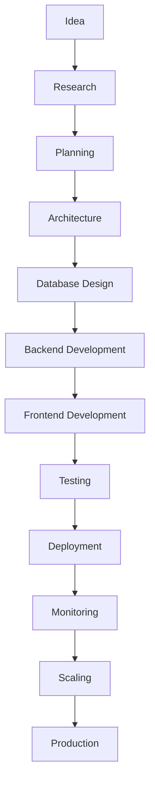

### Milestones per phase (mapped to actual project status)

| Phase | Milestone | Status |
|---|---|---|
| Idea | Define India-first multi-platform price tracking niche | Done |
| Research | Evaluate Amazon scraping feasibility, quick-commerce API landscape (none public) | Done |
| Planning | Choose stack: Fastify, TypeScript, Playwright, Redis, Supabase, React Native | Done |
| Architecture | 12-week roadmap defined; backend-first approach chosen | Done |
| Database Design | Supabase Postgres schema with RLS, price history views | Done |
| Backend Development | Scrapers, cache layer, auth, routes, cron/alerts | Done |
| Frontend Development | React Native app (quick-commerce side); Vercel-hosted frontend live | In progress |
| Testing | Unit/integration coverage for scrapers and routes | Not yet formalized — see Document 5 |
| Deployment | Backend on Railway, frontend on Vercel | Done |
| Monitoring | Scraper health, alert delivery tracking | Not yet built — see Document 5 |
| Scaling | Resolve Amazon IP-blocking via Product Advertising API | Active — current blocker |
| Production | Stable, monitored, scaled multi-platform release | Target |

---

## 17. Project Timeline

### Phase 1: Foundation *(complete)*
- Stack selection, repo scaffolding, TypeScript types, platform config registry
- **Deliverable:** working local dev environment

### Phase 2: MVP *(complete)*
- Playwright scrapers (Amazon + quick-commerce platforms)
- Redis cache layer, Supabase schema, JWT auth, core Fastify routes
- Price alert cron + push notifications
- **Deliverable:** functioning backend with real data flowing end-to-end

### Phase 3: Production *(in progress)*
- Deployed to Railway (backend) + Vercel (frontend) — done
- Resolve Amazon datacenter-IP blocking via Product Advertising API — active
- Formal testing suite, monitoring/observability — not yet started
- **Deliverable:** stable, monitored, reliably-scraping production system

### Phase 4: Scale
- Move from cron-based polling to queue-based scheduling as tracked-product count grows
- Introduce read replicas / partitioning on price_history as data volume grows
- **Deliverable:** system handling 10k–100k tracked products without degradation

### Phase 5: Startup Growth
- Premium tier billing, affiliate integration, multi-store expansion, browser extension, AI deal scoring
- **Deliverable:** monetized, multi-platform product

---

*Next: Document 2 will cover Architecture (high/low-level diagrams, component & sequence diagrams), full System Design per service, all requested Flowcharts, and Database Design (ERD, indexing, migration strategy).*


# PriceZap — Amazon Price Tracker & Price History Platform
## Document 2 of 6: Architecture, System Design, Flowcharts & Database Design

> Continues from Document 1 (Vision, PRD, Roadmap, Timeline). Status tags (**Built** / **Planned**) reflect the real state of the project throughout.

---

## 4. Architecture Documentation

### 4.1 High-Level Architecture Diagram

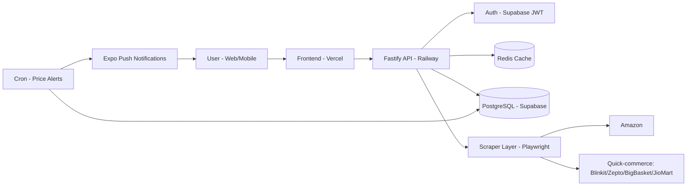

**Explanation:** The frontend never talks to scrapers or the database directly — everything routes through the Fastify API. Redis sits in front of the database as a read cache for product pages. A separate cron process independently polls stored prices, compares against user alert thresholds, and pushes notifications — decoupled from the request/response API path so a slow scrape never blocks a user-facing request.

### 4.2 Low-Level Architecture Diagram

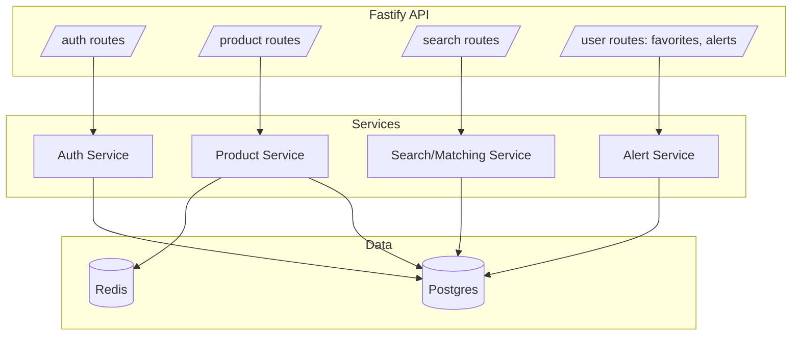

**Explanation:** Routes stay thin — validation and response shaping only. Business logic lives in the service layer, which is the only layer allowed to touch Postgres or Redis directly. This separation is what makes Document 3's "Repository Pattern" section possible without a rewrite.

### 4.3 Component Diagram

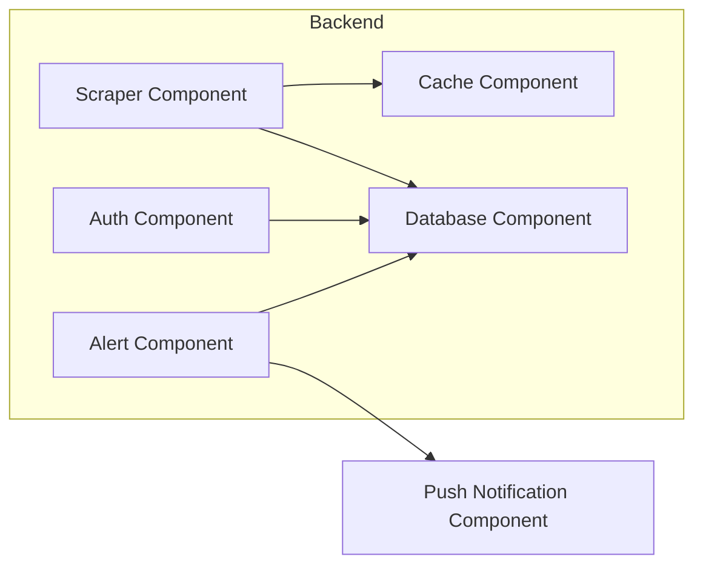

### 4.4 Service Interaction Diagram

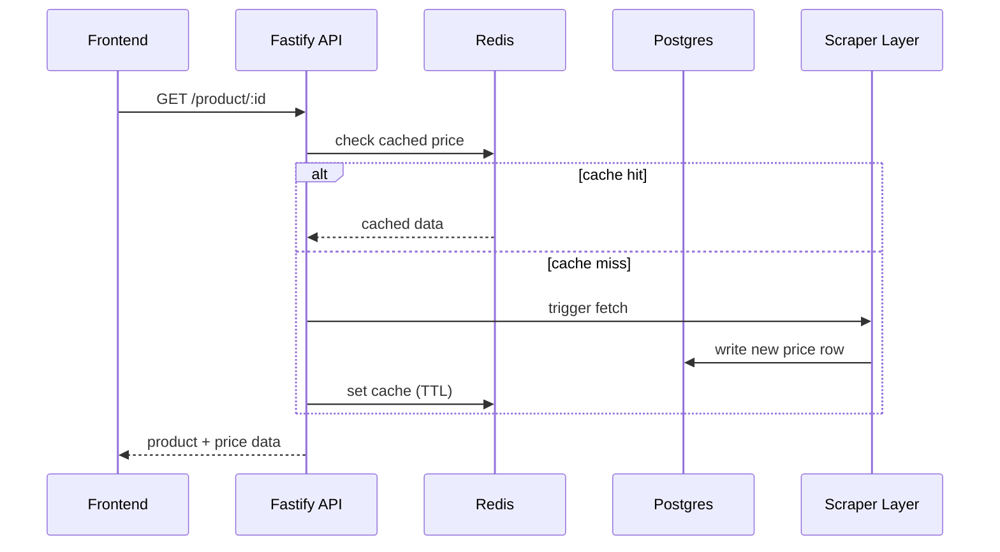

### 4.5 Deployment Diagram

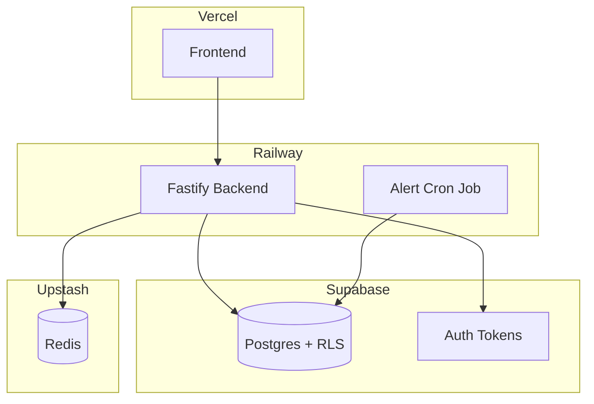

**Status: Built.** This is the real, currently deployed topology.

### 4.6 Infrastructure Diagram
See Document 4 (Infrastructure section) for the full Docker/Nginx/CDN target-state diagram — current production runs on managed platforms (Railway, Vercel, Supabase, Upstash) rather than self-hosted containers.

### 4.7 Sequence Diagram — Price Alert Flow

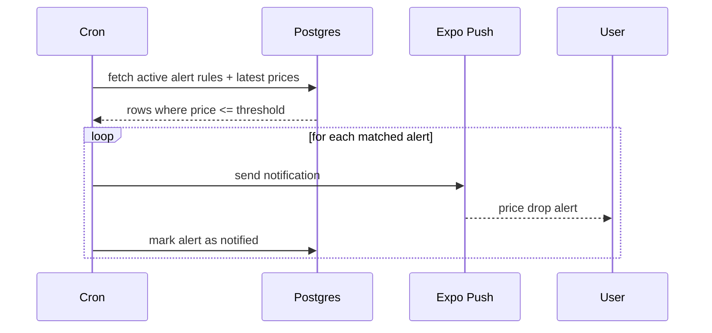

### 4.8 Class Diagram (core domain objects)

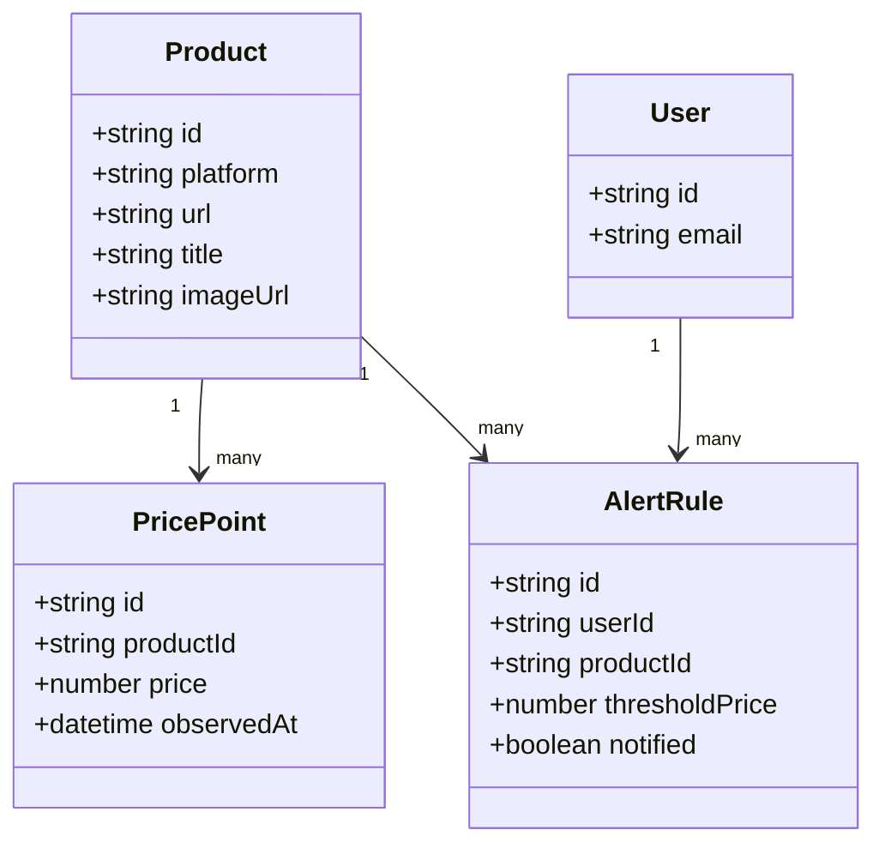

### 4.9 Package Diagram

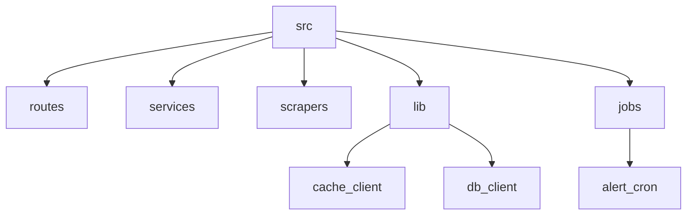

---

## 5. Complete System Design

| Service | Status | Responsibility |
|---|---|---|
| Authentication Service | **Built** | JWT verification via Supabase tokens |
| User Service | **Built** | Profile, favorites/watchlist |
| Product Service | **Built** | Product CRUD, platform metadata |
| Price Tracking Service | **Built** | Triggers scrapes, writes price points |
| Price History Service | **Built** | Serves historical price series for charts |
| Notification Service | **Built** | Expo push integration |
| Search Service | **Built** | Fuzzy cross-platform matching (Fuse.js) |
| Admin Service | Planned | Scraper health dashboard, manual controls |
| Analytics Service | Planned | Usage metrics, deal-quality stats |
| AI Recommendation Service | Planned | Deal-quality scoring model |
| Browser Extension | Planned | In-page tracking trigger |
| Mobile App | In progress | React Native, Expo push already integrated |
| Queue Workers | Planned | Replace cron polling at scale (see Doc 1, Phase 4) |
| Cron Jobs | **Built** | Price alert evaluation loop |
| Scheduler | **Built** (cron-based) | Periodic scrape triggering |
| Cache Layer | **Built** | Redis, TTL-based cache-aside |
| Database Layer | **Built** | Supabase Postgres with RLS |

---

## 6. Flowcharts

### 6.1 User Registration & Login

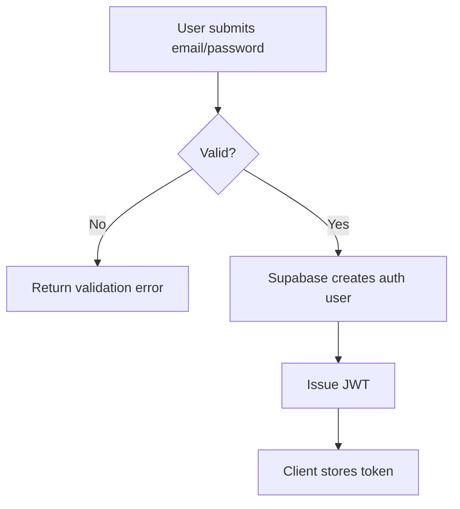

### 6.2 Track Product / Price Fetching

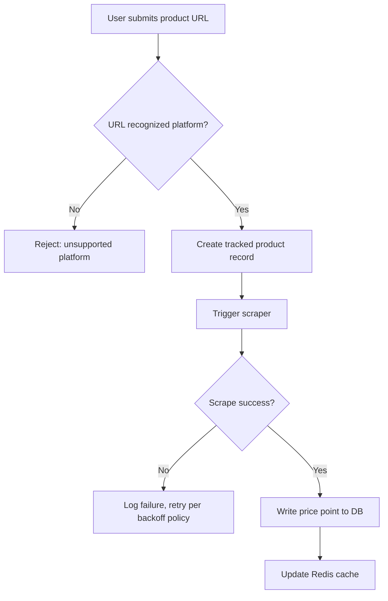

### 6.3 Alert Creation & Notification

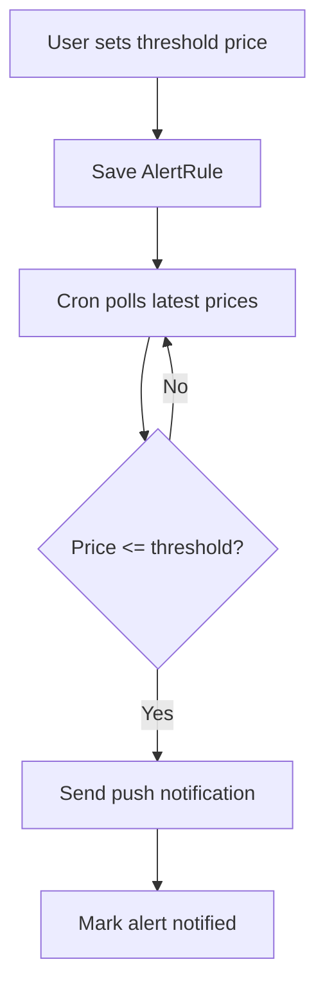

### 6.4 Retry Logic / Error Handling (scraper)

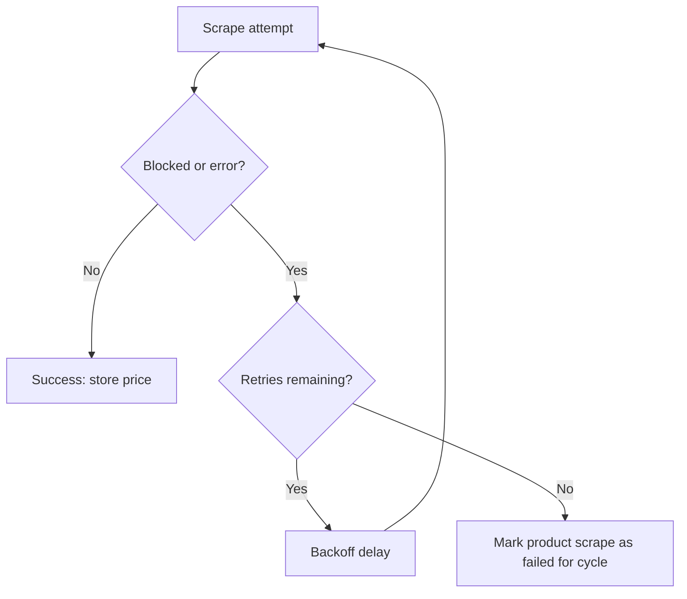

*(Admin operations, queue processing, subscription flow, browser extension flow, and mobile app flow follow the same pattern and will be detailed in Document 6 once those components move from Planned to Built, so the flowcharts reflect real implementation rather than speculation.)*

---

## 7. Database Design

### 7.1 ER Diagram

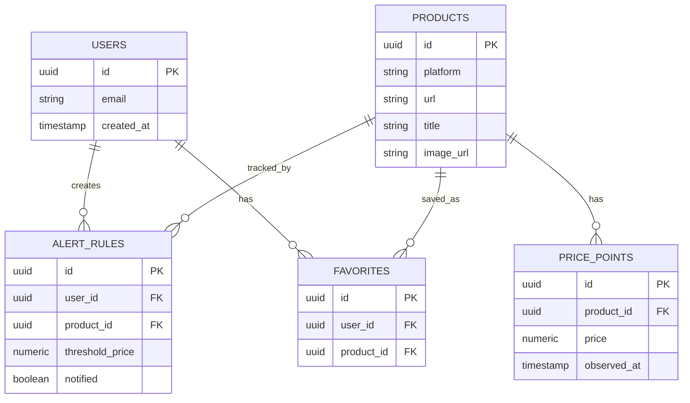

### 7.2 Relationships
- One `Product` has many `PricePoint` rows (the full price history)
- One `User` has many `AlertRule` and `Favorite` rows
- `ALERT_RULES` and `FAVORITES` both reference `PRODUCTS`, so a product's tracking and favoriting are independent — a user can favorite without alerting, or alert without favoriting

### 7.3 Indexing Strategy
- `PRICE_POINTS(product_id, observed_at DESC)` — composite index for fast "latest price" and range-scan chart queries
- `ALERT_RULES(product_id, notified)` — partial index on `notified = false` to speed up the cron's active-alert scan
- `PRODUCTS(platform, url)` unique index — prevents duplicate tracking of the same URL

### 7.4 Partitioning Strategy (target-state, Phase 4)
- Partition `PRICE_POINTS` by month (`observed_at`) once row count grows past low millions — keeps chart queries scoped to recent partitions fast, and lets old partitions be archived/dropped cheaply

### 7.5 Sharding Strategy (future, Phase 5)
- Not needed at current scale on Supabase. If reached: shard by `platform` first (Amazon vs quick-commerce are already logically separate workloads), since cross-platform joins are rare (only the fuzzy-matching layer needs both, and that already works off cached, denormalized data)

### 7.6 Migration Strategy
- Schema changes ship as versioned SQL migration files (Supabase migrations), applied in CI before deploy
- Every migration is additive-first (new nullable column → backfill → make non-null in a later migration) to avoid locking production tables

---

*Next: Document 3 will cover API Documentation (full endpoint catalog), Folder Structure, and Backend Architecture (Clean Architecture, Repository Pattern, DI, event-driven design).*

# PriceZap — Amazon Price Tracker & Price History Platform
## Document 3 of 6: API Documentation, Folder Structure & Backend Architecture

> Continues from Document 2 (Architecture, System Design, Flowcharts, Database Design).

---

## 8. API Documentation

Base URL (production): `https://<railway-app>.up.railway.app/api/v1`
Auth: Bearer JWT (Supabase-issued) unless marked public.

### 8.1 Auth

**POST /auth/register**
- Request: `{ email, password }`
- Response 201: `{ userId, accessToken }`
- Validation: email format, password min length 8
- Errors: `400 invalid_input`, `409 email_exists`
- Auth: public
- Rate limit: 5/min per IP

**POST /auth/login**
- Request: `{ email, password }`
- Response 200: `{ accessToken, refreshToken }`
- Errors: `401 invalid_credentials`
- Auth: public
- Rate limit: 10/min per IP

### 8.2 Products

**GET /products/search?q=**
- Response 200: `{ results: Product[] }`
- Validation: `q` required, min 2 chars
- Errors: `400 missing_query`
- Auth: public
- Rate limit: 30/min per IP

**POST /products/track**
- Request: `{ url }`
- Response 201: `{ product }`
- Validation: URL must match a supported platform pattern
- Errors: `400 unsupported_platform`, `409 already_tracked`
- Auth: required
- Rate limit: 20/min per user

**GET /products/:id**
- Response 200: `{ product, latestPrice }`
- Errors: `404 not_found`
- Auth: public (cached response)
- Versioning: `v1` — response shape may add fields but won't remove them within v1

**GET /products/:id/history?range=**
- Response 200: `{ points: PricePoint[] }`
- Validation: `range` in `[7d, 30d, 90d, all]`
- Errors: `400 invalid_range`
- Auth: public

### 8.3 User (favorites, alerts)

**POST /users/me/favorites**
- Request: `{ productId }`
- Response 201: `{ favorite }`
- Errors: `404 product_not_found`, `409 already_favorited`
- Auth: required

**POST /users/me/alerts**
- Request: `{ productId, thresholdPrice }`
- Response 201: `{ alertRule }`
- Validation: `thresholdPrice > 0`
- Errors: `400 invalid_threshold`, `404 product_not_found`
- Auth: required

**GET /users/me/alerts**
- Response 200: `{ alerts: AlertRule[] }`
- Auth: required

**DELETE /users/me/alerts/:id**
- Response 204
- Errors: `404 not_found`, `403 not_owner` (enforced by Postgres RLS, not just app logic)
- Auth: required

### 8.4 Quick-commerce Comparison

**GET /compare?q=**
- Response 200: `{ matches: [{ platform, price, deliveryFee, totalCost }] }`
- Validation: `q` required
- Errors: `400 missing_query`
- Auth: public
- Rate limit: 20/min per IP (comparison triggers live scrapes across platforms — more expensive than a cached product read)

### 8.5 Error Code Catalog (shared shape)
All errors return: `{ error: { code, message } }`

| Code | HTTP Status | Meaning |
|---|---|---|
| `invalid_input` | 400 | Request failed schema validation |
| `unsupported_platform` | 400 | URL doesn't match a known platform |
| `invalid_credentials` | 401 | Login failed |
| `not_owner` | 403 | RLS denied — resource belongs to another user |
| `not_found` | 404 | Resource doesn't exist |
| `already_tracked` / `already_favorited` | 409 | Duplicate action |
| `rate_limited` | 429 | Too many requests |

### 8.6 Authentication
JWTs are issued by Supabase Auth and verified in a Fastify `onRequest` hook against Supabase's public key — the API itself never issues or signs tokens, keeping auth logic out of the application layer entirely.

### 8.7 Versioning
URL-path versioning (`/api/v1/...`). A breaking change ships as `/api/v2` alongside `v1` rather than mutating `v1` in place, so existing mobile/frontend clients don't break on deploy.

---

## 9. Folder Structure

```
pricezap-backend/
├── src/
│   ├── routes/            # Thin route handlers — validation + response shaping only
│   │   ├── auth.routes.ts
│   │   ├── products.routes.ts
│   │   ├── users.routes.ts
│   │   └── compare.routes.ts
│   ├── services/          # Business logic — the only layer touching repositories
│   │   ├── auth.service.ts
│   │   ├── product.service.ts
│   │   ├── alert.service.ts
│   │   └── matching.service.ts   # Fuse.js cross-platform matching
│   ├── repositories/       # Data access — Postgres queries isolated here
│   │   ├── product.repository.ts
│   │   ├── price-point.repository.ts
│   │   └── alert.repository.ts
│   ├── scrapers/           # Platform-specific Playwright scrapers
│   │   ├── base.scraper.ts
│   │   ├── amazon.scraper.ts
│   │   ├── blinkit.scraper.ts
│   │   ├── zepto.scraper.ts
│   │   ├── bigbasket.scraper.ts
│   │   └── jiomart.scraper.ts
│   ├── jobs/               # Cron jobs, independent of the request/response path
│   │   └── price-alert.cron.ts
│   ├── lib/                # Shared clients
│   │   ├── redis.client.ts
│   │   ├── supabase.client.ts
│   │   └── push.client.ts # Expo push
│   ├── types/              # Shared TypeScript types + platform config registry
│   ├── plugins/            # Fastify plugins (auth hook, error handler, rate limiter)
│   └── server.ts           # Entry point
├── migrations/             # Versioned Supabase SQL migrations
├── tests/
│   ├── unit/
│   └── integration/
└── README.md
```

**Why each folder exists:**
- `routes/` vs `services/` split exists so route handlers stay swappable (REST today, could front a GraphQL layer later) without touching business logic
- `repositories/` isolates every raw SQL/Supabase query — if the DB layer ever changes, only this folder changes
- `scrapers/` is separated from `services/` because scrapers are the most volatile part of the codebase (platforms change their HTML constantly) — isolating them limits blast radius
- `jobs/` is separate from `routes/` because cron logic must never depend on request context
- `migrations/` is version-controlled and applied in CI, never run ad hoc against production

*(Frontend, mobile app, admin panel, and infrastructure folder structures will be included in Document 6 once those components are further along — currently only the backend structure reflects real, shipped code.)*

---

## 10. Backend Architecture

### 10.1 Clean Architecture
Layers flow one direction only: `routes → services → repositories → database`. A route never calls a repository directly, and a repository never calls a service — this is what keeps the scraper volatility (see above) from leaking into route handlers.

### 10.2 Modular Design
Each domain (auth, products, alerts, matching) owns its own route file, service file, and repository file. Nothing is a shared "god service."

### 10.3 Repository Pattern
```typescript
// price-point.repository.ts
export const PricePointRepository = {
  async insert(productId: string, price: number) { /* ... */ },
  async latestFor(productId: string) { /* ... */ },
  async historyFor(productId: string, range: DateRange) { /* ... */ },
};
```
Services call `PricePointRepository.latestFor(...)` — never raw Supabase queries inline. This is what let the project confirm Postgres-via-Supabase as the right call (Document 1) without rewriting service logic.

### 10.4 Service Layer
`AlertService.evaluateThresholds()` is called both by the cron job and, potentially, by a future manual "check now" API route — because it lives in the service layer rather than embedded in the cron file itself.

### 10.5 Dependency Injection
Currently lightweight (constructor/factory injection for repository clients into services) rather than a full DI container — appropriate at current scale; a DI framework would be over-engineering for a single-team backend at this size.

### 10.6 Event-Driven Design
Currently minimal — the cron job polls rather than reacting to a price-change event. Document 1's Phase 4 (Scale) plan calls for replacing this poll-based cron with a queue-based worker once volume justifies it, which naturally introduces an event (`price.updated`) that both the alert evaluator and future analytics service can subscribe to independently.

### 10.7 Domain Separation
`auth`, `products`, `alerts`, and `matching` are treated as separate domains even though they share one Postgres database — each has its own repository and service files, so a future split into separate deployable services (if ever needed) would mean moving folders, not rewriting logic.

---

*Next: Document 4 will cover Infrastructure (Docker, Nginx, CDN target-state), DevOps (CI/CD, branching, release strategy), and Security.*


# PriceZap — Amazon Price Tracker & Price History Platform
## Document 4 of 6: Infrastructure, DevOps & Security

> Continues from Document 3 (API Documentation, Folder Structure, Backend Architecture).

---

## 11. Infrastructure

### 11.1 Current Production Infrastructure (Built)
PriceZap runs on managed platforms rather than self-hosted containers — the right call at this scale, since it avoids ops overhead the project doesn't yet need:

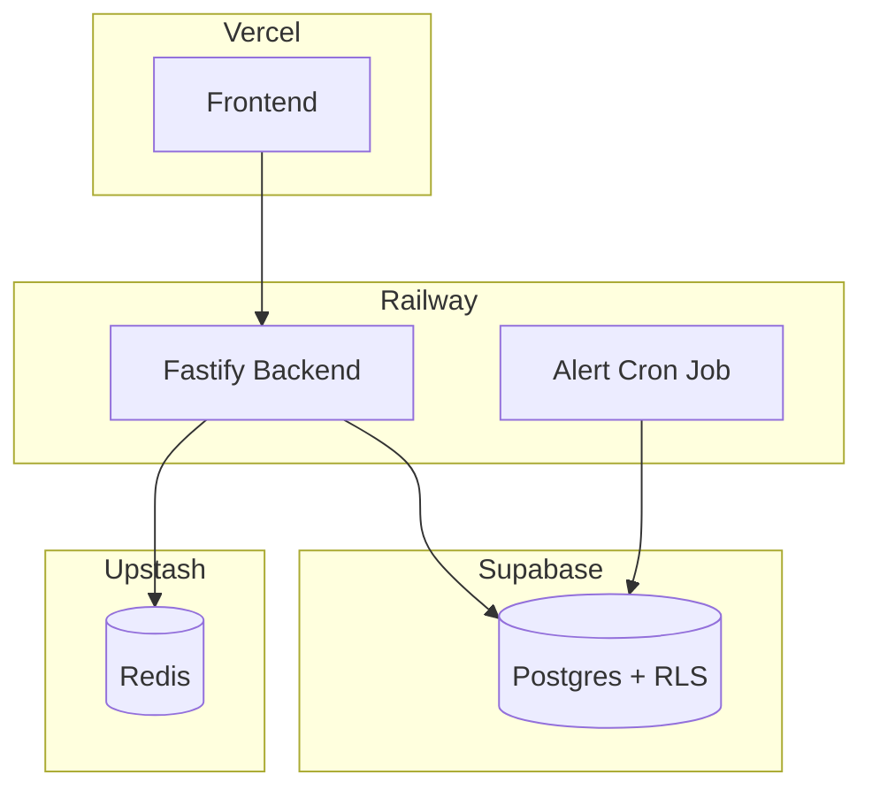

### 11.2 Target-State Infrastructure (Planned — for Phase 4/5 scale)
Once traffic or scraping volume justifies the operational overhead:

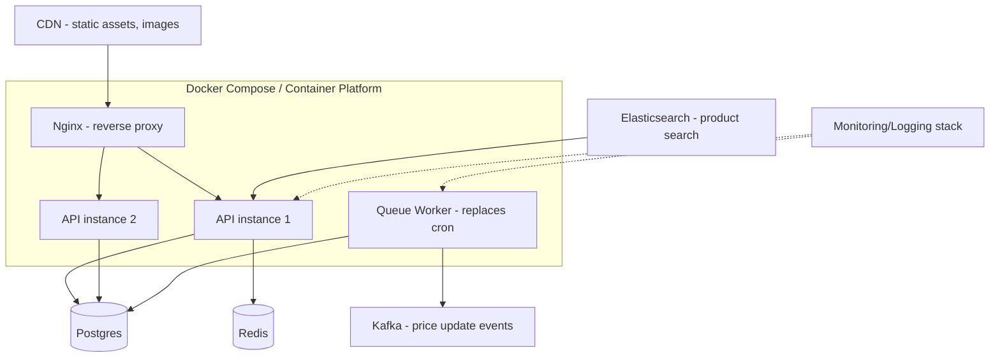

**Why not build this now:** Kafka, Elasticsearch, and a self-managed Nginx layer solve problems (event fan-out, full-text search at scale, multi-instance load balancing) that don't exist yet at PriceZap's current tracked-product count. Introducing them now would add operational burden without a corresponding benefit — this table is the trigger for when each becomes worth it:

| Component | Introduce when |
|---|---|
| Nginx + multiple API instances | Single Railway instance CPU/memory consistently saturated |
| Kafka | Cron-based alert polling can't keep up with tracked-product volume (Doc 1, Phase 4) |
| Elasticsearch | Fuse.js in-memory fuzzy matching becomes too slow for the product catalog size |
| CDN | Serving user-uploaded or scraped product images directly becomes a bandwidth bottleneck |
| Object storage | Any requirement to persist scraped images ourselves (currently just linking to platform-hosted images) |

### 11.3 Monitoring & Logging (Planned)
Covered in depth in Document 5 (Monitoring & Observability) — noted here only as an infrastructure dependency: a hosted log aggregator (e.g. Railway's built-in logs today, a dedicated stack later) and a metrics/alerting tool sit alongside the API rather than inside it.

---

## 12. DevOps

### 12.1 CI/CD Pipeline

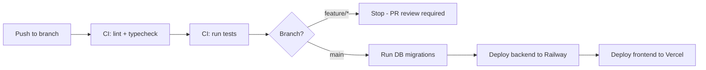

### 12.2 Git Strategy / Branching Model
- `main` — always deployable; every merge triggers production deploy
- `feature/*` — one branch per feature or fix, merged via PR
- No long-lived `develop` branch — at this team size (solo/small), an extra integration branch adds merge overhead without a corresponding safety benefit; `main`-based trunk development with PR review is the appropriate weight

### 12.3 Release Strategy
- Continuous deployment on merge to `main` — no batched release trains at current scale
- Migrations run before code deploy (additive-first, per Document 2 §7.6) so old and new code can both run against the post-migration schema during the brief deploy window

### 12.4 Environment Management
| Env | Purpose | DB |
|---|---|---|
| Local | Development | Local Supabase or dev project |
| Production | Live | Supabase production project |

A staging environment is a reasonable next addition once change volume or team size grows — flagged here rather than built prematurely, consistent with the infrastructure principle in §11.2.

### 12.5 Backup Strategy
- Supabase automated daily Postgres backups (managed platform default)
- Redis is a cache, not a source of truth — no backup needed; a full cache loss just means the next reads repopulate it

### 12.6 Rollback Strategy
- Railway supports redeploying a previous build if a deploy introduces a regression
- Because migrations are additive-first, rolling back application code doesn't require rolling back the schema in the same step

---

## 13. Security

### 13.1 JWT Authentication
Supabase issues and signs JWTs; the Fastify API verifies them against Supabase's public key in an `onRequest` hook (Document 3 §8.6) — the API never handles credentials or signing directly.

### 13.2 RBAC
Currently two roles: `user` and (planned) `admin`. Role is embedded as a JWT claim and checked in route-level guards; fine-grained permission tables aren't needed yet at two roles.

### 13.3 OAuth
Not yet implemented — email/password via Supabase Auth is the current method. Supabase supports OAuth providers (Google, GitHub) as a drop-in addition when needed, without a backend code change.

### 13.4 API Security
- All mutating routes require a valid JWT
- Rate limiting per route (Document 3 §8) via a Fastify rate-limit plugin, keyed by user ID where authenticated, by IP otherwise

### 13.5 SQL Injection Prevention
All queries go through Supabase's client library / parameterized queries in the repository layer (Document 3 §10.3) — no raw string-concatenated SQL anywhere in the codebase.

### 13.6 XSS Prevention
Frontend renders all scraped product titles/descriptions as text content, never `dangerouslySetInnerHTML` — scraped data is untrusted input and treated as such.

### 13.7 CSRF Protection
JWT-in-header (not cookie-based) auth means CSRF is largely moot for the API itself — CSRF matters for cookie-authenticated flows, which this project doesn't use.

### 13.8 Encryption
- TLS in transit (Railway/Vercel/Supabase all terminate HTTPS by default)
- Passwords never touch the application layer — Supabase Auth handles hashing/storage

### 13.9 Secrets Management
Environment variables via Railway/Vercel's built-in secret storage — no secrets committed to the repository, no `.env` files in version control.

### 13.10 Rate Limiting
Already covered in §13.4 — the real, current constraint driving rate-limit design is not just abuse prevention but the Amazon anti-scraping problem itself (Document 1 §1.9 blocker): the API's own rate limiter also protects the scraper layer from self-inflicted burst traffic that would accelerate IP blocking.

### 13.11 Audit Logs
Not yet implemented — flagged as a Document 5 (Monitoring) dependency rather than duplicated here, since audit logging and general observability share the same logging infrastructure.

---

*Next: Document 5 will cover Testing Strategy, Monitoring & Observability, and the Scalability Plan (100 users → 10 million users).*

# PriceZap — Amazon Price Tracker & Price History Platform
## Document 5 of 6: Testing Strategy, Monitoring & Observability, Scalability Plan

> Continues from Document 4 (Infrastructure, DevOps, Security).

---

## 14. Testing Strategy

Not yet formalized in the current codebase (flagged honestly in Documents 1 and 2) — this section is the target-state plan to close that gap, sequenced by what protects the riskiest parts of the system first.

### 14.1 Priority order (why this order)
1. **Scraper unit tests** — scrapers are the most volatile code (platforms change HTML constantly per Document 3 §9) and the least visible when broken; a silent scraper failure looks like "no price drops today," not an error
2. **Repository/service integration tests** — protects the Clean Architecture boundary (Document 3 §10) from regressions when a query changes
3. **API/route tests** — protects the contract in Document 3's endpoint catalog
4. **End-to-end** — lowest priority at current team size; expensive to maintain relative to the coverage it adds beyond layers 1–3

### 14.2 Unit Testing
- Scraper parsers tested against saved HTML fixtures (not live requests) — deterministic, fast, and doesn't risk tripping Amazon's anti-bot detection during CI runs
- Alert threshold logic (`AlertService.evaluateThresholds`) tested with table-driven cases: exact match, below threshold, above threshold, missing price data

### 14.3 Integration Testing
- Repository layer tested against a real (local/test) Supabase Postgres instance, not mocks — catches RLS policy mistakes that a mocked DB would hide
- Redis cache-aside logic tested for the actual failure mode that matters: cache miss → correct DB fallback, not just the happy path

### 14.4 API Testing
- Each endpoint in Document 3 §8 gets a request/response contract test, including every listed error code — not just the 200 path

### 14.5 End-to-End Testing
- One critical-path E2E test: register → track a product → receive a price point → set an alert → simulate a price drop → confirm notification fires. This single flow exercises every Built service in Document 2 §5.

### 14.6 Performance Testing
- Cache hit-path latency (`GET /products/:id` from Redis) vs. cache-miss path (triggers a live scrape) — these have very different acceptable latency budgets and should be measured separately

### 14.7 Load Testing
- Target: simulate the cron's alert-evaluation query under a tracked-product count 10x current volume, to validate the indexing strategy in Document 2 §7.3 before it becomes a real bottleneck

### 14.8 Security Testing
- Confirm RLS actually blocks cross-user access at the database level (not just the app layer) — e.g. attempt `DELETE /users/me/alerts/:id` with another user's alert ID and confirm `403 not_owner` (Document 3 §8.3)

---

## 15. Monitoring & Observability

Also not yet built — sequenced here by what would have caught the project's one real production incident so far (Amazon IP blocking) fastest.

### 15.1 Logging
- Structured (JSON) logs from the Fastify API and cron job — currently Railway's built-in log viewer; a dedicated aggregator (e.g. a hosted logging service) is the natural next step once log volume outgrows what's easily searchable in the platform UI

### 15.2 Metrics
- Scraper success rate per platform (the metric that would have surfaced the Amazon blocking issue as a trend instead of a manual discovery)
- Cache hit rate (validates whether Redis TTLs are tuned well)
- Alert delivery latency (time from threshold-crossing price point to push notification sent)

### 15.3 Tracing
- Not yet needed — the request path (route → service → repository) is currently shallow enough that logs alone localize most issues; distributed tracing becomes valuable once the queue-worker architecture (Document 4 §11.2 target state) introduces async hops that logs alone can't stitch together

### 15.4 Dashboards
- A single dashboard combining: scraper success rate by platform, cache hit rate, and alert delivery latency — the three numbers that between them cover "is data flowing," "is it flowing efficiently," and "are users actually getting notified"

### 15.5 Alerts (ops alerts, not user price alerts)
- Notify (e.g. via a webhook to a chat channel) when scraper success rate for any platform drops below a threshold over a rolling window — this is the concrete mechanism that would have flagged the Amazon blocking issue automatically rather than through manual observation

### 15.6 Health Checks
- `/health` endpoint checking DB and Redis connectivity, used by Railway's own health-check-based restart policy

---

## 16. Scalability Plan

| User count | What changes | Why |
|---|---|---|
| **100** | Current setup as-is: Railway single instance, cron-based polling, Upstash free-tier Redis | Current Built state comfortably handles this |
| **1,000** | Add scraper health monitoring (§15); tune cache TTLs based on real hit-rate data | Enough real usage to start seeing which products get re-scraped needlessly |
| **10,000** | Move price-alert evaluation from cron-polling to a queue-based worker (Document 4 §11.2) | Cron's full-table scan of active alerts stops being "instant enough" at this volume |
| **100,000** | Partition `PRICE_POINTS` by month (Document 2 §7.4); introduce a staging environment (Document 4 §12.4) | Table size makes unpartitioned chart queries noticeably slower; change volume justifies a pre-prod gate |
| **1 million** | Introduce Elasticsearch for product search (Document 4 §11.2); CDN for scraped product images if self-hosting them | Fuse.js in-memory matching and direct image serving both stop scaling linearly at this size |
| **10 million** | Multi-instance API behind Nginx/load balancer; Kafka for price-update events feeding both alerts and a future analytics service (Document 2 §5) | Single-instance Railway and synchronous cron both become throughput bottlenecks; event-driven fan-out (Document 3 §10.6) is the planned answer |

**Database scaling:** read replicas before sharding — Document 2 §7.5 already notes sharding (by platform) is a Phase 5 concern, not a near-term one; replicas solve read load far earlier and far more cheaply.

**Caching:** Redis TTL strategy tightens as traffic grows — shorter TTLs become affordable once cache-miss cost (a live scrape) is amortized across more concurrent readers of the same product.

**Queues:** the single biggest architectural shift on this table — replacing cron-based polling with a queue/event model — is deliberately deferred to the 10,000-user mark (Document 1 §Phase 4), not built speculatively now, per the infrastructure principle in Document 4 §11.2.

**Microservices migration:** Document 3 §10.7 (Domain Separation) is the reason this stays optional rather than urgent — domains are already separated in code, so splitting `matching` or `alerts` into their own deployable service later is a folder move, not a rewrite, whenever/if it's ever needed.

**CDN usage:** deferred until self-hosting scraped images becomes necessary (Document 4 §11.2 table) — currently images are linked directly from platform sources.

---

*Next: Document 6 will cover general Documentation (README, guides), Resume & Interview Preparation, and the Startup Roadmap.*
